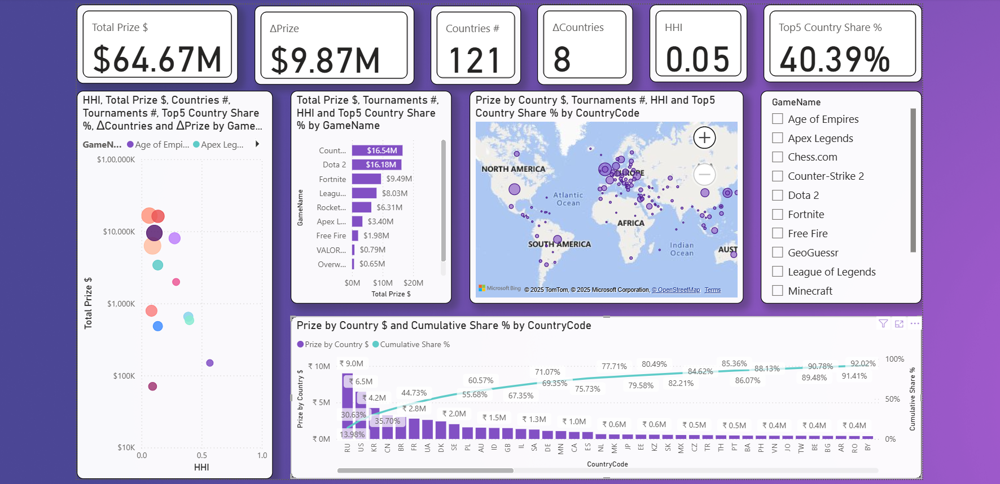
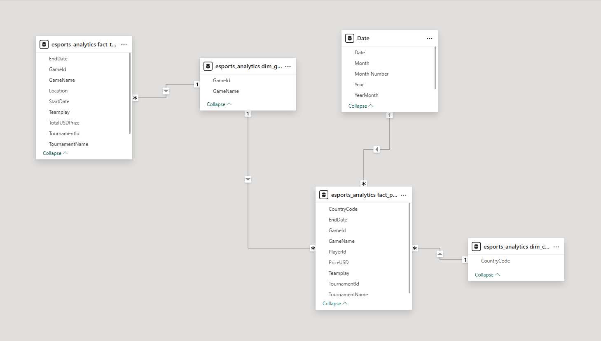
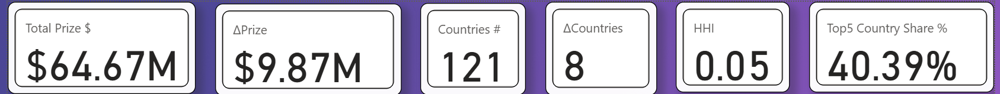

# Esports Analytics — SQL → Power BI

A clean, end-to-end analytics project using **MySQL** for data modeling and **Power BI** for interactive reporting on esports prize pools, market concentration, and country participation.

Converted fragmented tournament data into action—ranked games by ROI drivers and caught 26 events (2.4%) with >5% prize discrepancies.

> **Tech stack:** MySQL • Power Query (M) • DAX • Power BI  
> **Owner:** Pooja Patel • **Use case:** Portfolio-quality data analytics project

---


<br>

## Overview

**Goal:** Prioritize esports sponsorship/investment and go-to-market by identifying the titles and regions that drive prize money, event density, and reach—while flagging payout mismatches.

**Data:** EsportsEarnings (Python API: `games`, `tournaments`, `player_results`) · **34,653** player-result rows / **1,086** tournaments / **55** games · **Oct 23, 2024 → Sep 7, 2025**

**Deliverable:** Interactive Power BI report answering: 
* Which titles deserve budget (prize × tournaments × country reach)?
* Which geographies matter most?
* Which games are gaining/losing momentum (last-180-day deltas)?
* What’s the team vs solo split?
* Where do prize payouts not reconcile at the tournament level?

<br>

---

## 🎯 Business Problems Addressed

- **Title prioritization & budget allocation:** Which games warrant sponsorship/investment based on total player prize pools, event density, and country reach?
- **Geographic go-to-market:** Which countries matter most for each title, and where does prize money actually land?
- **Concentration & portfolio risk:** How dependent is a title on a few countries (Top-5 share/HHI) versus a broad global spread?
- **Momentum tracking (last-180-day deltas):** Which titles are accelerating or cooling in prize, tournaments, and coverage compared to the prior 180 days?
- **Format planning:** What’s the team vs solo prize mix by title, and how should that shape roster and content strategy?
- **Tournament-level reconciliation (QA):** Where do published prize pools not reconcile with summed player payouts, and which events need review?
- **Regional drilldowns (where applicable):** Stage/region breakouts (e.g., Valorant) to inform league- and region-specific strategy.
- **Sponsor ROI focus:** Given finite budget, what is the optimal title/geo mix to maximize reach and prize-weighted impact while reducing low-ROI exposure?

<br>

---

## 🧱 Data & Model (Simple)

**Flow:** Raw CSVs (Kaggle) → **SQL** (clean/transform, keys & types) → **Power BI** (model, DAX, visuals)

**Tables used:**

- `esports_analytics fact_tournaments` — tournaments grain (TournamentId, GameId, StartDate/EndDate, Location, Teamplay, TotalUSDPrize)
- `esports_analytics fact_player_results` — player-result grain (TournamentId, PlayerId, GameId, CountryCode, EndDate, PrizeUSD, Teamplay, ValorantRegion/Stage)
- `esports_analytics dim_games` — game lookup (GameId, GameName)
- `esports_analytics dim_countries` — country lookup (CountryCode)
- `Date` — canonical calendar (Date, Month, Month Number, Year, YearMonth)

**Key relationships:**

- `fact_tournaments[GameId]` **→** `dim_games[GameId]` (many-to-one)
- `fact_player_results[GameId]` **→** `dim_games[GameId]` (many-to-one)
- `fact_player_results[CountryCode]` **→** `dim_countries[CountryCode]` (many-to-one)
- `Date[Date]` **→** `fact_player_results[EndDate]` (one-to-many, time intelligence for payouts)

> Note: Tournament-level time uses `StartDate/EndDate` in `fact_tournaments`; core time-series visuals are driven by `fact_player_results[EndDate]` via the `Date` table.



<br>

---

## 🧮 SQL Work

- **DDL & Database Bootstrap:** `sql/00_create_database.sql`
  Creates the `esports_analytics_new` database (UTF-8) and enables safe CSV loading.

- **Tables (Staging):** `sql/01_create_tables.sql`
  Defines `stg_tournaments`, `stg_games`, `stg_player_results` with helpful indexes.

- **Load & Sanity Checks:** `sql/02_load_data.sql`
  Loads all three CSVs via `LOAD DATA LOCAL INFILE`, prints row counts and peeks; de-dupes per `(TournamentId, PlayerId, GameId, ValorantStage)` and adds a uniqueness guard.

- **Cleaning (Idempotent):** `sql/03_data_clean.sql`
  Trims names/codes, uppercases country codes (unknown → `ZZ`), normalizes `Teamplay` to 0/1, fixes `Year` from `EndDate`, standardizes `Location='Online'`, and stages integrity checks.

- **Star Tables & QA Views:** `sql/04_helper_views.sql`
  Builds `dim_game`, `dim_country`, `fact_tournament`, `fact_player_result` with FKs; adds `v_prize_recon` (tournament prize vs player sum) and `fact_player_result_clean` (excludes >5% mismatches for analysis).

- **Analysis Views (Feed Power BI):** `sql/05_analysis_views.sql`
  Provides `v_game_country`, `v_game_total`, `v_game_concentration` (Top-5 share & HHI), `v_game_breadth`, and `v_game_velocity` (last-180d vs prior-180d deltas).

**Examples:**

_Momentum — last 180d vs previous 180d (by game)_

```sql
SELECT
  GameId, GameName,
  prize_P1, prize_P0, (prize_P1 - prize_P0) AS d_prize,
  t_P1, t_P0, (t_P1 - t_P0) AS d_tourneys,
  c_P1, c_P0, (c_P1 - c_P0) AS d_countries
FROM v_game_velocity
ORDER BY d_prize DESC;
```

_Payout QA — tournaments with >5% mismatch_

```sql
SELECT *
FROM v_prize_recon
WHERE ABS(delta_pct) > 0.05
ORDER BY ABS(delta_pct) DESC;
```

<br>

---

## 📊 Power BI

**Model:**
Facts — `esports_analytics fact_player_result_clean`, `esports_analytics fact_tournaments`
Dims — `esports_analytics dim_games`, `esports_analytics dim_countries`, `Date`
**Relationships by key:**

- `fact_player_result_clean[GameId]` → `dim_games[GameId]` (M:1)
- `fact_tournaments[GameId]` → `dim_games[GameId]` (M:1)
- `fact_player_result_clean[CountryCode]` → `dim_countries[CountryCode]` (M:1)
- `Date[Date]` → `fact_player_result_clean[EndDate]` (1\:M)

**Measures (DAX):**
Core set includes: **Total Prize \$**, **Known Prize \$** (ex-“ZZ”), **Tournaments #**, **Countries #**, **Top5 Country \$**, **Top5 Country Share %**, **HHI**, **Prize (Last/Prev 180d)**, **ΔPrize**, **Countries #(Last/Prev 180d)**, **ΔCountries**, plus country ranking & cumulative share measures.

**Report Pages:**

- **KPI Overview** — cards for Total Prize \$, ΔPrize, Countries #, ΔCountries, HHI, Top-5 Share %.
- **Core Drivers** — prize by game (bar), geo map (country prize), HHI vs Total Prize (scatter).
- **Deep Dives** — country Pareto (prize & cumulative share), filters by GameName; reconciliation/QA table (optional).

<br>

---

## 📌 KPIs

- **Total Prize \$** — Sum of player payouts (`PrizeUSD`) over the selected period.
- **Countries #** — Distinct count of `CountryCode` with prize > 0 (geo reach).
- **ΔPrize (Last 180d − Prev 180d)** — Momentum of prize dollars vs the prior 180-day window.
- **ΔCountries (Last 180d − Prev 180d)** — Change in geo coverage vs the prior 180-day window.
- **Top-5 Country Share %** — % of total prize contributed by the top 5 countries (Pareto).
- **HHI (Geo Concentration)** — Herfindahl-Hirschman Index on country prize shares (lower = more diversified).

> These KPIs sit on `fact_player_result_clean` with time intelligence from the `Date` table; momentum KPIs compare the last 180 days to the preceding 180 days for quick trend reads.



<br>

---

## 💡 Insights (Highlights)

- **Scope analyzed:** **33,813** player results, **1,086** tournaments, **13** titles, **122** countries.
- **Market size & concentration:** \~**\$65.4M** paid across **1,068** tournaments; top **5 games** (CS2, Dota 2, Fortnite, LoL, Rocket League) drive **\~\$57.3M (\~88%)**.
- **Momentum (last 180d vs prior 180d):** **CS2 +\$2.94M**, **Fortnite +\$2.53M**, **Rocket League +\$1.26M** (with **–54** tournaments → larger purses). **Dota 2 –\$0.59M**, **LoL –\$0.01M**.
- **Reach vs depth (geo):** **Rocket League (96)** and **Fortnite (85)** countries = widest reach; **CS2 (82)** broad; **Dota 2 (50)** and **LoL (40)** narrower but deep.
- **Concentration risk:** **LoL** top-5 countries ≈ **81%** of prize; **Free Fire** ≈ **94%**; **Dota 2** ≈ **56%** (more diversified).
- **Format mix:** **\~95.4%** of prize money is **team-based** (solo ≈ **4.6%**).
- **Data/finance QA:** **26 tournaments (\~2.4%)** show **>5%** payout mismatch; **4** exceed **20%**.
- **India lens:** \~**\$55.7k** total; led by **Chess.com (\~\$36.4k)**, **CS2 (\~\$10.0k)**, **Fortnite (\~\$6.5k)**.

<br>

---

## 🚀 How to Run

**Prereqs:** Power BI Desktop · MySQL 8.0+ · MySQL Connector/ODBC 8.0+

**SQL Setup:** run in order → `sql/00_create_database.sql` → `sql/01_create_tables.sql` → `sql/02_load_data.sql` → `sql/03_data_clean.sql` → `sql/04_helper_views.sql` → `sql/05_analysis_views.sql`

**Open PBIX:** `pbix/Esports_Analytics.pbix` → **File › Options and settings › Data Source Settings** → point to your MySQL server/db → **Refresh**

**Quick steps:**

* Create/prepare DB:
* Create tables:
* Load CSVs (edit file paths inside `02_load_data.sql` if needed):
* Clean & standardize:
* Build star helpers & QA views:
* Build analysis views (Power BI uses these):
* Open **`pbix/Esports_Analytics.pbix`** → update MySQL connection (server, database `esports_analytics_new`) → **Home › Refresh**.

<br>

---

## Repository Structure

```
.
└─ data/
   ├─ games.csv
   ├─ player_results.csv
   └─ tournaments.csv
├─ docs/
│  ├─ CaseStudy.md
│  ├─ KPI_Definitions.md
│  ├─ Data_Dictionary.md
│  └─ Process_and_Design.md
├─ images/
│  ├─ dashboard.png
│  ├─ kpi.png
│  ├─ model_view.png
│  ├─ country_pareto.png
│  └─ ...
├─ powerbi/
│  ├─ Esports_Analytics.pbit
│  └─ Esports_Analytics.pbix
├─ scripts/
│  └─ esports_pull.py
├─ sql/
│  ├─ 00_create_database.sql
│  ├─ 01_create_tables.sql
│  ├─ 02_load_data.sql
│  ├─ 03_data_clean.sql
│  ├─ 04_helper_views.sql
│  └─ 05_analysis_views.sql
├─ LICENSE
└─ README.md
```

<br>

---

## 🧩 Assumptions & Notes

* **Data source & window**
  * Pulled via **Python API** from the Esports Earnings website (not Kaggle). Fixed window: **Oct 23, 2024 → Sep 7, 2025**. All amounts in **USD**.

* **Keys & grain**
  * Facts at **tournament** (`TournamentId`) and **player-result** (`TournamentId + PlayerId`); titles keyed by `GameId`/`GameName`; countries by upper-cased codes.

* **Cleaning & standardization**
  * Trimmed names/codes; `CountryCode` unknowns → **`ZZ`**; `Teamplay` normalized to **0=Solo/1=Team**; dates from `EndDate` (payouts) and `StartDate/EndDate` (tournaments).

* **Coverage & counting rules**
  * **Tournaments #**: tournaments with player payouts.
  * **Countries #**: distinct pay-out countries (use “Known” metrics to exclude `ZZ`).
  * **Prize per Tournament** uses **player payouts**, not published pools.

* **Quality & exclusions**

  * Events with **>5%** payout vs. published prize mismatch are excluded from topline KPIs (still listed in a QA table).

* **Metrics & methodology**
  * **Top-5 Country Share %**, **HHI** (geo concentration). **Momentum (Δ)** compares **last 180d** vs **previous 180d**.
  * Small rounding differences may appear due to decimal rounding in visuals.

* **Power BI modeling**

  * Star schema in Power BI—`fact_player_result_clean`, `fact_tournaments` ↔ `dim_games`, `dim_countries`, `Date`; mark `Date` as the date table.

* **Environment notes**

  * Power BI Desktop **June 2025+**, MySQL **8.0+**, MySQL ODBC **8.0 (x64)**.

* **Caveats**

  * Public esports data can contain late corrections (DQ, redistributions, undisclosed appearance fees).
  * `ValorantRegion/Stage` fields are sparsely populated and used opportunistically for drill-downs.

<br>

---

## Ethics & Limitations

* **Prize pools ≠ salaries**; interpret as **prize concentration**, not earnings power.
* Country rollups **exclude “ZZ”** after proper team split to avoid bias.

<br>

---

## License

MIT

