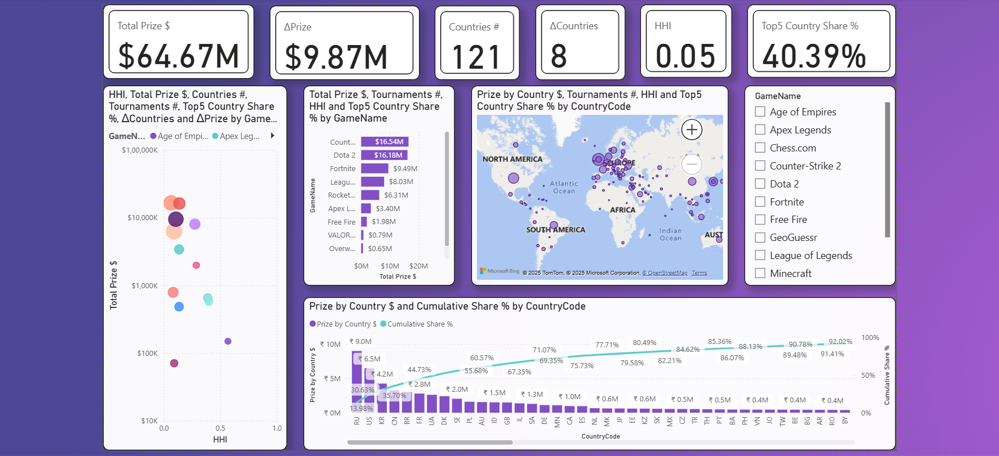
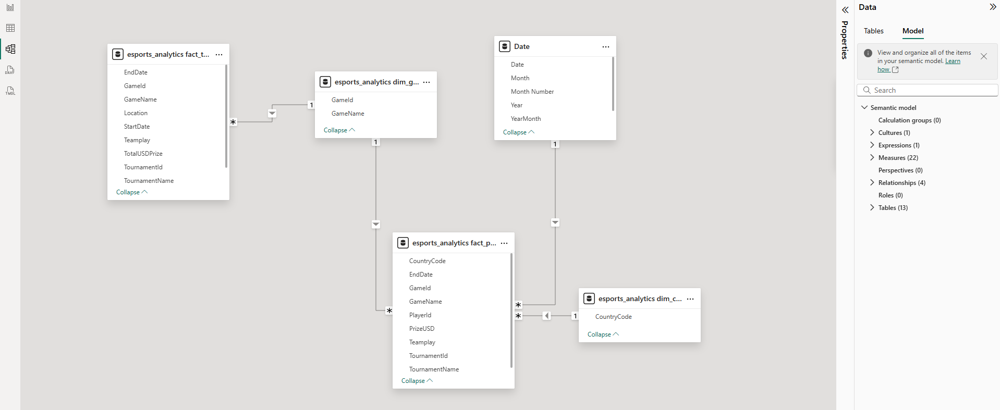
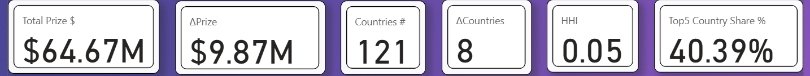
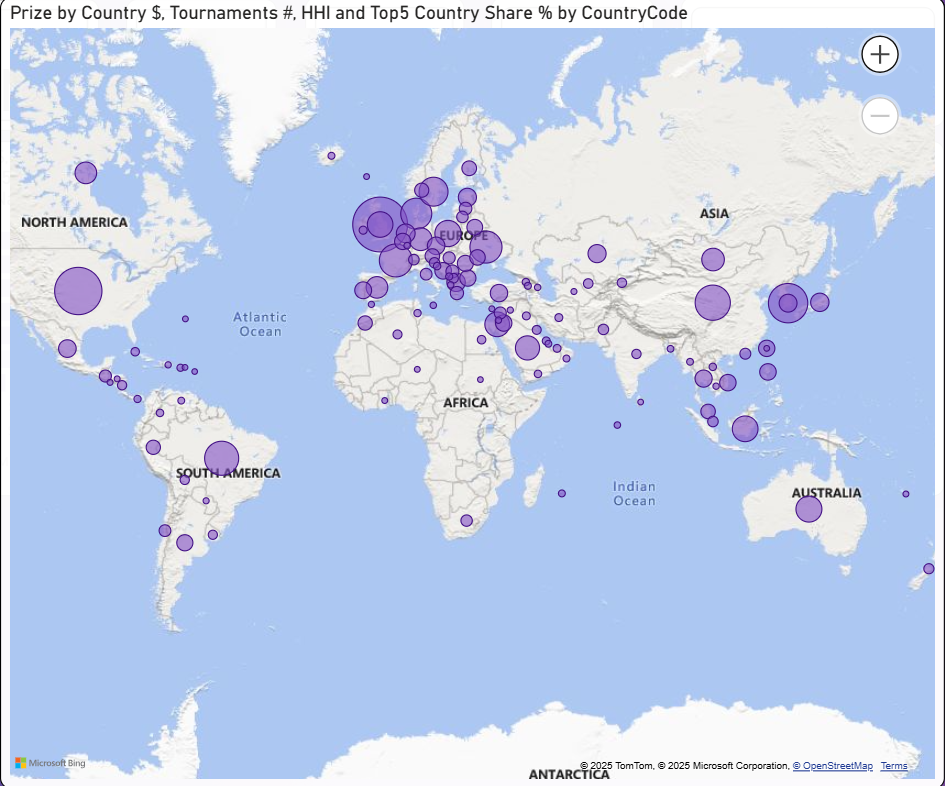

# Esports Prize Landscape — Case Study (SQL → Power BI)

> Quantifying **where esports prize money concentrates** (by **game** and **country**), how **distributed** each title is (**HHI**, **Top-5 share**), and which titles show **momentum** (**180-day velocity**).



---

## 1) Executive Summary

In this study, I analyze multi-year tournament data to size the prize-pool economy, assess concentration and geographic breadth, and detect growth momentum by title.

* **Scope analyzed:** **33,813** player results, **1,086** tournaments, **13** titles, **122** countries.&#x20;
* **Market size (slice):** **\$63.67M** total prize pools across the 13 titles.&#x20;
* **Consolidation:** The top four titles (CS2, Dota 2, Fortnite, LoL) account for **\~78.8%** of prize capital.&#x20;
* **Distribution:** **Counter-Strike 2** is the most globally distributed title (HHI ≈ **0.065**). **Age of Empires** is highly concentrated (HHI ≈ **0.568**).&#x20;
* **Momentum (last 180d vs previous 180d):** **Fortnite** (+\$3.62M; +123%) and **CS2** (+\$3.33M; +50%) lead growth.&#x20;

**Who uses this**: tournament organizers, sponsors/investors, publishers, and market researchers making portfolio and geo-expansion calls.&#x20;

---

## 2) Business Context & Questions

**Objective:** Help stakeholders decide **where to invest** (premium vs breadth plays), **which titles/countries are growing**, and **how concentrated** each ecosystem is.&#x20;

**Key questions**

1. Which **games** dominate total prize pools?
2. Which **countries** lead by prize?
3. How concentrated is each game’s geography (**Top-5 Country Share**, **HHI**)?
4. Which titles show **momentum** over the last 180 days?&#x20;

> **Interpretation note:** These are **prize pools**, not player salaries. Use “prize pool concentration” language.&#x20;

---

## 3) Data Sources & Semantics

* **Primary spine:** EsportsEarnings (API/CSV). Fields include `TournamentId`, `GameId`, `TotalUSDPrize`, `Teamplay`, dates, and location.&#x20;
* **Enrichment (optional):** Valorant regional CSVs (VCT), Liquipedia tiers for cross-checks.&#x20;

**Team vs Solo handling (critical):**

* `Teamplay=false` → use per-player results directly (prize already at player level).
* `Teamplay=true` → split team prize **equally** across *(known players + `UnknownPlayerCount`)*, then attribute to countries. Handle zero-known cases safely.&#x20;
* **Country rollups** exclude `CountryCode="ZZ"` **after** the team split, to avoid bias. &#x20;

---

## 4) Scope & Coverage

* **Facts:** `fact_player_result_clean` (**33,813** rows), `fact_tournament` (**1,086** rows). Keys: `TournamentId, GameId, PlayerId, CountryCode, PrizeUSD, EndDate`.&#x20;
* **Dims:** `dim_game` (**13** rows), `dim_country` (**122** rows; includes `"ZZ"` for unknown).&#x20;

---

## 5) Methodology

### 5.1 Data Model (Power BI star schema)

* One-to-many from `dim_game`, `dim_country` to facts; date intelligence for period analysis.&#x20;

> *Insert screenshot:*
> 

### 5.2 Analytical SQL views (semantic layer)

* `v_game_total` (prize & tournament aggregations),
* `v_game_breadth` (geographic participation by game),
* `v_game_concentration` (**Top-5 share**, **HHI**),
* `v_game_velocity` (P1 vs P0 180-day momentum),
* `v_prize_recon` (player vs tournament reconciliation).&#x20;

> *Optional ERD:*
> 

### 5.3 Measures (Power BI)

Core measures driving the dashboard: **Total Prize \$**, **Known Prize \$** (ex-ZZ), **Tournaments #**, **Countries #**, **Top5 Country \$**, **Top5 Country Share %**, **HHI**, **Prize (Last/Prev 180d)**, **ΔPrize**, **ΔCountries**, **Cumulative Prize \$**, **Cumulative Share %**, **Rank Country by Prize**.&#x20;

> *Insert screenshot:*
> 

**Selected DAX (working patterns):**

```dax
Known Prize $ =
CALCULATE([Total Prize $], 'esports_analytics fact_player_result_clean'[CountryCode] <> "ZZ")
```

```dax
HHI =
VAR Total = [Known Prize $]
RETURN
SUMX(
  SUMMARIZE(
    'esports_analytics fact_player_result_clean',
    'esports_analytics fact_player_result_clean'[CountryCode],
    "P",
      CALCULATE(
        SUM('esports_analytics fact_player_result_clean'[PrizeUSD]),
        'esports_analytics fact_player_result_clean'[CountryCode] <> "ZZ"
      )
  ),
  VAR p = [P]
  RETURN POWER(DIVIDE(p, Total), 2)
)
```


```dax
Top5 Country $ =
VAR T =
  TOPN(
    5,
    SUMMARIZE(
      'esports_analytics fact_player_result_clean',
      'esports_analytics fact_player_result_clean'[CountryCode],
      "P",
        CALCULATE(
          SUM('esports_analytics fact_player_result_clean'[PrizeUSD]),
          'esports_analytics fact_player_result_clean'[CountryCode] <> "ZZ"
        )
    ),
    [P], DESC
  )
RETURN SUMX(T, [P])
```


```dax
Prize (Last 180d) =
CALCULATE(
  [Known Prize $],
  DATESINPERIOD('Date'[Date], MAX('Date'[Date]), -180, DAY)
)
```


---

## 6) Dashboard Walkthrough (Screenshots)

**KPI Cards** — Total Prize, Known Prize, Tournaments, Countries, Top-5 Country Share, HHI, Velocity highlights.


**Top Games by Prize** — bar/Pareto to show concentration by title.


**Pareto (Top-5 Country Share)** — cumulative share visualization for country concentration.


**Geographic Reach** — map or ranked table for countries per game.


**Velocity (180d vs prev 180d)** — growth deltas by title (prize, tournaments, countries).


**Concentration vs Size (HHI scatter)** — HHI on X; prize or countries on Y; point = game.


**Prize per Tournament** — ecosystem efficiency lens.


---

## 7) Results & Insights

### 7.1 Prize Pool Economics

* Total prize pool across titles in this slice: **\$63.67M**.&#x20;
* **Tier-1 titles** (>\$8M): **CS2 \$16.54M**, **Dota 2 \$16.18M**, **Fortnite \$9.49M**, **LoL \$8.03M**. Together, **\~78.8%** of prize capital.&#x20;

### 7.2 Geographic Breadth vs Concentration

* **Breadth leaders**: **Rocket League** (**95** countries), **Fortnite** (**83**), **CS2** (**81**).&#x20;
* **Concentration**: **CS2** HHI ≈ **0.065** (most globally distributed), **LoL** HHI ≈ **0.275**, **Age of Empires** HHI ≈ **0.568** (highly concentrated).&#x20;

### 7.3 Velocity & Growth (Last 180d vs Previous 180d)

* **Fortnite**: **+\$3.62M** (**+123%**), **+85** tournaments, **+13** countries.
* **CS2**: **+\$3.33M** (**+50%**), **+150** tournaments, **+23** countries.
* **Rocket League**: **+\$1.42M** (**+58%**), despite **–39** tournaments.&#x20;

### 7.4 Ecosystem Efficiency

* **Prize per tournament** spectrum—from **premium consolidation** (fewer, high-value events: Dota 2, Apex) to **grassroots saturation** (frequent, distributed competitions: CS2).&#x20;

---

## 8) Recommendations

* **Portfolio strategy:** Blend **premium** (LoL/Dota-style flagship events) with **breadth** (CS2/Fortnite volume for reach).&#x20;
* **Geo expansion:** Target high-HHI, narrow-reach titles (e.g., **Age of Empires**) for **new country activation**; continue scaling **CS2**’s globally distributed model.&#x20;
* **Momentum bets:** Prioritize **Fortnite** and **CS2** in the near term given velocity.&#x20;

---

## 9) Quality Assurance & Validation

* **Reconciliation view** compares tournament-level totals vs aggregated player-level prizes and flags deltas.
* **Unknown handling**: rigorous treatment of `"ZZ"` after team-split attribution.
* **Data health** (from build): model \~**1.65MB**, organized measures, star schema; validation/reconciliation baked in. &#x20;

> *Insert screenshot:*
> 

> *Operations note (example achievements from the build):* high completeness and duplicate control; tournament coverage; reconciliation tolerance to surface true mismatches.&#x20;

---

## 10) Limitations & Ethics

* **Prize pools ≠ earnings** (exclude salaries/sponsorships); interpret as **prize concentration** only.&#x20;
* Coverage and encoding of **unknown countries** (`"ZZ"`) can bias naive rollups—handled explicitly here via post-split exclusion.&#x20;
* Data recency varies by source; I prioritize API-based pulls and document assumptions.

---

## 11) Reproducibility

1. **SQL layer:** Run `/sql/00_schema.sql` → `/sql/03_quality_checks.sql` to create facts/dims and views (`v_game_total`, `v_game_breadth`, `v_game_concentration`, `v_game_velocity`, `v_prize_recon`).&#x20;
2. **Power BI:** Open `/powerbi/Esports_Analytics.pbit`, set your SQL connection, **Refresh**, and validate against screenshots.&#x20;
3. **(Optional) Python fetch:** keep a tiny `scripts/fetch_esports_api.py` that pulls tournaments/results with your API key; don’t commit raw dumps. (See README’s “Optional: Python helper”.)&#x20;

---

## 12) Appendix A — Selected DAX (paste from the model)

> Include your final, report-used versions here for reviewers.

* **Known Prize \$** (ex-ZZ)
* **Top5 Country \$** / **Top5 Country Share %**
* **HHI**
* **Prize (Last 180d)** / **Prize (Prev 180d)** / **ΔPrize**
* **Countries # (Last/Prev 180d)** / **ΔCountries**
* **Cumulative Prize \$** / **Cumulative Share %**
  (Working patterns shown above; export your production measures for completeness.)&#x20;

---

## 13) Appendix B — Screenshot Checklist

* `img/dashboard-overview.png` (hero)
* `img/kpi-cards.png` (main KPIs)
* `img/top-games-bar.png` (Top N by prize)
* `img/pareto-top5.png` (cumulative share)
* `img/countries-map.png` (breadth)
* `img/velocity-180d.png` (momentum)
* `img/hhi-scatter.png` (concentration vs size)
* `img/prize-per-tournament.png` (efficiency)
* `img/data-model-relationships.png` (model)
* `img/reconciliation-view.png` (QA)
* `img/dax-measures-folder.png` (craft)

---

**Contact:** *Pooja Patel • Data Analyst*
