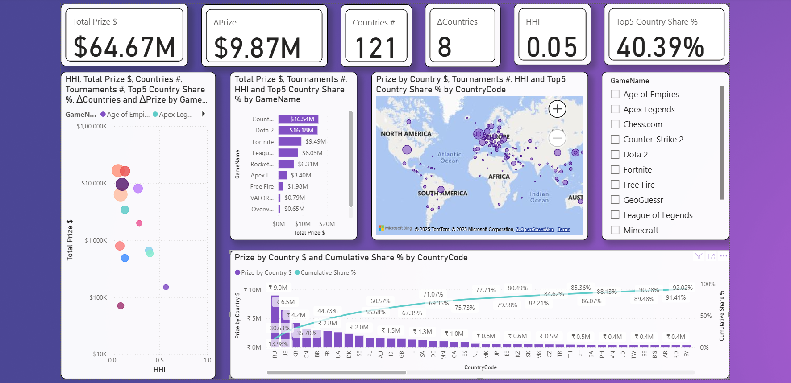
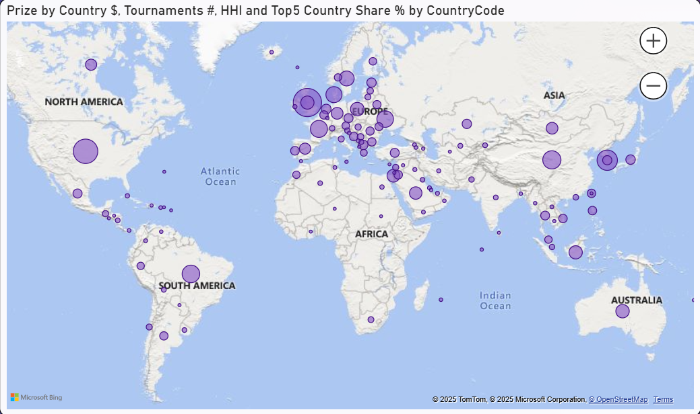

# Esports Prize Landscape — Case Study (SQL + Power BI)

Esports prize data is scattered: the same tournament shows up multiple times across sources, player payouts don’t always reconcile with tournament totals, and “online vs LAN” or “team vs solo” dynamics are hidden in free-form text. This project turns that noise into a reliable market view using a lightweight SQL → Power BI pipeline.

> **Stack:** Python (API ingest) → MySQL (clean & star schema) → Power BI (model, DAX)  
> **Source:** EsportsEarnings via a custom Python pull (`esports_pull.py`), writing `tournaments.csv`, `games.csv`, `player_results.csv`.

---

## Executive Summary

This project maps where esports prize money is **concentrating** and **gaining momentum**—by **game** and **country**—so sponsors, teams, and tournament organizers can make confident budget, market, and format decisions. Using a per-player, per-tournament grain with transparent KPIs (Total Prize, Countries, HHI/Top-5 share, and 180-day deltas), the pipeline (Python → MySQL star schema → Power BI) delivers an auditable, slice-and-dice view of the landscape.

**Scale & scope (last 365 days)**

* **\$65.44M** player prize across **1,068** tournaments (**\~\$61.3k** avg/tournament).
* **Top games:** CS2 **\$16.64M**, Dota 2 **\$16.19M**, Fortnite **\$9.98M**, LoL **\$8.03M**, Rocket League **\$6.46M**.
* **Top countries:** RU **\$9.00M**, US **\$6.61M**, KR **\$4.24M**, CN **\$3.27M**, BR **\$3.02M** (Unknown “ZZ” **\$0.37M**).

**Breadth vs. concentration**

* **Coverage leaders (countries paid):** Rocket League **96**, Fortnite **85**, CS2 **82** (vs Dota 2 **50**, LoL **40**).
* **Concentration:** LoL Top-5 ≈ **81%** (KR-anchored), Dota 2 ≈ **56%**, Free Fire ≈ **94%** (ID-led).

**Momentum (last 180d vs prior 180d)**

* **Accelerating:** CS2 **+\$2.94M**, **+109** tournaments, **+9** countries; Fortnite **+\$2.53M**, **+43**, **+10**.
* **Consolidating up-market:** Rocket League **+\$1.26M** with **–54** tournaments.
* **Emerging:** GeoGuessr **+\$70.7k**, **+19** countries.
* **Soft patches:** LoL (slight dip), Dota 2 (calendar-driven –\$0.59M).

**Format mix & QA**

* **\~95.4%** of prize is **team-based**; solo titles are niche in \$ terms.
* **Data QA:** **26/1,086** tournaments show >5% payout mismatch; **4** exceed 20%—flagged via a reconciliation view for manual review.

**Actionable takeaways**

* Pair **scale** (CS2/Dota 2) with **reach** (Rocket League/Fortnite).
* Tilt spend toward titles with **positive ΔPrize** and **manageable HHI**; scout geos with rising share.
* Maintain the **QA tile** to keep finance and data integrity tight.

---

## Business Context & Problem

* **Title prioritization & budget allocation:** Which games warrant sponsorships/investment based on total player prize pools and event counts.
* **Geographic go-to-market:** Which countries (and how many) each title reaches; where prize money actually lands.
* **Concentration & portfolio risk:** How dependent a game is on a few countries (Top-5 share, HHI) vs. broad global spread.
* **Momentum tracking (velocity):** Which titles accelerated or cooled off in the last 180 days vs. the previous 180 days (prize, tournaments, country coverage).
* **Format planning:** Team vs solo prize mix → informs roster strategy and content planning.
* **Finance/data QA:** Tournament-level reconciliation (sum of player payouts vs. published prize pool) to flag misalignments and data-quality issues.
* **Regional drilldowns (VALORANT regions/stages):** Where available, breakouts by stage/region to inform league-specific strategy.

**Success metric.** A slice-ready report with transparent definitions for **Total Prize, Countries, HHI/Top-5, ΔPrize, ΔCountries**, plus a QA surface for suspect tournaments. (DAX measures implemented in PBIX; see measure names like **Total Prize \$**, **Countries #**, **HHI**, **ΔPrize**, **Top5 Country Share %**. )

---

## Data & Grain

**Grain.** Player × Tournament — each row is a player’s USD prize share on that tournament’s **EndDate**.
**Window.** Last **365 days** (as pulled).
**Currency.** USD (no FX/inflation normalization).

**Known-only metrics.** Country rollups (e.g., **Top-5 share**, **HHI**, **Countries #**) exclude `CountryCode="ZZ"`.

**QA scope.** Curated facts omit tournaments that fail reconciliation (see **§8** for rule).

---

## Methodology

**Pipeline**

1. **Python ingest** — pulls recent tournaments, maps `GameId→GameName`, fetches solo/team results, splits team prize **equally** across roster, emits CSVs. VALORANT region/stage parsed heuristically.
   
2. **SQL clean & star** — staging tables, trims/upper-cases, normalizes unknowns to `"ZZ"`
   * builds dims (`dim_game`, `dim_country`) and facts (`fact_tournament`, `fact_player_result`), adds QA view `v_prize_recon`, and curated `fact_player_result_clean`.

3. **Power BI model & DAX** — Facts ↔ `Date` ↔ `dim_game`/`dim_country`
   * measures for totals, breadth, concentration, and 180-day deltas (**Prize (Last/Prev 180d), ΔPrize; Countries #(Last/Prev), ΔCountries; HHI; Top5 Country Share %**).

> SQL artifacts include `v_game_total`, `v_game_breadth`, `v_game_concentration` (Top-5 share & HHI), `v_game_velocity` (last-180d vs prior-180d).

---

## Results & Insights

**Overall market snapshot**

* **Total player prize distributed:** ≈ **\$65.44M** across **1,068** tournaments; **avg ≈ \$61.3k** per tournament.
* **Top games by prize (365d):**

  1. **Counter-Strike 2** ≈ **\$16.64M**
  2. **Dota 2** ≈ **\$16.19M**
  3. **Fortnite** ≈ **\$9.98M**
  4. **League of Legends** ≈ **\$8.03M**
  5. **Rocket League** ≈ **\$6.46M**
* **Top countries by prize (365d):** **RU \~\$9.00M**, **US \~\$6.61M**, **KR \~\$4.24M**, **CN \~\$3.27M**, **BR \~\$3.02M** (unknown/“ZZ”: \~\$0.37M across 81 rows).

**Breadth & concentration (by game)**

* **Breadth (countries paid, 365d):** **Rocket League (96)**, **Fortnite (85)**, **CS2 (82)**, **Dota 2 (50)**, **LoL (40)** → RL/Fortnite are the widest global footprints.
* **Concentration (illustrative):**

  * **League of Legends:** top-5 countries ≈ **81%** of prize; **KR** dominant; **40** countries overall (moderate concentration, strong anchor markets).
  * **Dota 2:** top-5 ≈ **56%**; **50** countries (more distributed).
  * **Free Fire:** highly concentrated (top-5 ≈ **94%**), **ID** dominant.
  * **Overwatch 2:** concentrated around **KR**.
  * **Minecraft:** **US**-skewed.
* **Portfolio takeaway:** If you want both **scale + reach**, **RL** and **Fortnite** are coverage leaders; **CS2/Dota 2** deliver massive absolute prize pools with strong but narrower cores.

**Momentum (last 180d vs previous 180d)**

* **CS2:** **+ \$2.94M** prize, **+109** tournaments, **+9** countries → strong acceleration.
* **Fortnite:** **+ \$2.53M** prize, **+43** tournaments, **+10** countries → broad-based growth.
* **Rocket League:** **+ \$1.26M** prize with **fewer** tournaments (-54) → bigger average purses; consolidation at higher tiers.
* **GeoGuessr:** newly active (**+\$70.7k**, **+19** countries) → emerging niche.
* **LoL:** slight dip (**–\$8.7k**, **–15** tournaments, **–24** countries), likely calendar/format timing; still a top-tier title.
* **Dota 2:** **–\$0.59M** vs prior window (calendar effects around majors/flagship events).

**Team vs solo**

* **\~95.4%** of prize money is from **team** events (solo ≈ **4.6%**).
  Per-game: **Dota 2 / LoL / CS2 / RL / Apex** are \~100% team-driven; **Minecraft/Chess.com** carry the notable solo share but with much smaller totals.

**Tournament reconciliation (quality/finance)**

* Out of **1,086** tournaments, **26 (≈2.4%)** show **>5%** mismatch between published prize pools and summed player payouts; **4** exceed **20%**.
  *Action:* keep a QA tile that lists these for manual review (appearance fees, undisclosed splits, missing rounds, or data import issues).

**India lens**

* **IN total (365d): ≈ \$55.7k**, led by **Chess.com (\~\$36.35k)**, **CS2 (\~\$9.95k)**, **Fortnite (\~\$6.46k)**.
  → current footprint is small; targeted programs (qualifiers, collegiate circuits, creator-led events) could lift visibility and earnings.

**Top single events by player payouts (365d)**

* **EWC 2025 \[Dota 2]** \~\$3.00M
* **LoL Worlds 2024** \~\$2.225M
* **MSI 2025** \~\$2.00M
* **EWC 2025 \[LoL]** \~\$2.00M
* **ALGS 2024 Championship** \~\$2.00M
* **BLAST.tv Austin Major 2025 (CS2)** \~\$1.25M
* **Perfect World Shanghai Major 2024 (CS2)** \~\$1.25M
* **EWC 2025 (Rocket League)** \~\$1.01M

---

## Deep-Dive Patterns

1. **Country concentration vs depth**
   *How:* monthly **Top-5 share** and **Countries #** trend using `Date` table.
   *What it shows:* whether growth is broad-based (Top-5 flat/down while Countries # rises) or consolidating.

2. **Title mix & stability**
   *How:* monthly prize by GameName with a **3-month rolling mean**.
   *What it shows:* **steady titles** (e.g., RL) vs **spiky** (e.g., Dota 2 around flagships).

3. **VALORANT regions/stages** *(where populated)*
   *How:* split prize by `ValorantRegion/Stage`.
   *What it shows:* regional momentum (e.g., APAC vs EMEA) and stage-level focus.

---

## Recommendations

**For Sponsors/Brands**

* **Allocate by Scale + Reach:** Pair **CS2/Dota 2** (high \$ scale) with **Rocket League/Fortnite** (broad country reach) to balance ROI and audience breadth.
* **Chase Momentum:** Prioritize titles with **ΔPrize > 0** and **ΔCountries > 0** (e.g., CS2, Fortnite in the last 180d).
* **Concentration guardrail:** Prefer titles with **HHI < 0.10** or **Top-5 share < 60%** to avoid over-exposure to a few geos.

**For Teams/Organizations**

* **Scouting Heatmap:** Focus on countries with rising prize share inside momentum titles; set **monthly trials** in top-growing geos.
* **Roster Strategy:** Keep investment weighted toward **team formats (\~95%)**; test content/creator collabs in solo-skew niches (Minecraft/Chess.com) for efficient fan growth.

**For Tournament Organizers (TOs)**

* **Venue & Calendar:** Place events where **ΔCountries > 0** and HHI is moderate (healthy audience spread).
* **Tiering:** RL shows **bigger purses with fewer tournaments** → pursue **fewer, higher-tier** stops; for CS2/Fortnite, expand mid-tier qualifiers to capture growth.

**For Finance/Data QA**

* **Reconciliation Tile:** Review the **\~2.4%** tournaments with >5% mismatch; create a monthly QA task to tag causes (appearance fees, missing rounds, import gaps).
* **Governance:** Lock Known-only KPIs to **post-split** filtering (`ZZ` excluded **after** the split) to keep geo metrics unbiased.

**Suggested OKRs (next 2 quarters)**

* **+15%** budget shift into titles with **positive ΔPrize** and **HHI < 0.10**.
* **+10 new countries** activated across two focus titles (reach KPI).
* **<1%** of events with unresolved prize mismatches (QA KPI).

---

## Constraints & Assumptions

* **Unknown countries (`ZZ`).** Unknown/undisclosed countries are retained as `ZZ` for accounting integrity; **Known-only** KPIs exclude `ZZ` **after** team prize splitting.
* **Team vs Solo handling.**

  * `Teamplay = false` → per-player results used directly.
  * `Teamplay = true` → team prize is split **equally** across *(known players + `UnknownPlayerCount`)*; each share attributed to the player’s country.
  * **Zero-known team safety:** if no known players, all shares remain `ZZ` (no fabricated geo).
* **Reconciliation filter.** Tournaments are excluded when
  `ABS(Σ(player prize) − TotalUSDPrize) / TotalUSDPrize > threshold` (current tolerance: **5–10%**). These are listed via `v_prize_recon`; curated tables (e.g., `fact_player_result_clean`) exclude them.
* **Date semantics.** All per-player rows use the tournament **EndDate** for time windows and YoY comparisons.
* **Data coverage.** API completeness varies across titles/regions; results reflect available coverage in the pull window.

---

## Reproducibility (local run)

1. **Python:** run `esports_pull.py` (requires API key) → writes `tournaments.csv`, `games.csv`, `player_results.csv`.
2. **SQL:** execute scripts to create **staging** → **curated star** → **analysis views** (`v_game_total`, `v_game_breadth`, `v_game_concentration`, `v_game_velocity`; QA `v_prize_recon`).
3. **Power BI:** open `Esports_Analytics.pbix`, set MySQL connection, **Refresh**. Measures (e.g., **Known Prize \$**, **Top5 Country Share %**, **HHI**, **ΔPrize**) are defined in PBIX.

**Figures (see README):** `images/dashboard.png` (overview), `images/map.png` (geo), `images/pareto_countries.png` (Pareto), `images/model.png` (star schema).

---

## Next Steps

* Add **region dimension** (continent / publisher regions) for macro views.
* **Roster-aware splits** where official prize distributions are available.
* Additional momentum windows (**90d**, **YoY**) and **seasonality** per title.
* **FX normalization** for non-USD sources.

---

## Limitations & Ethics

* **Prize pools ≠ earnings** (exclude salaries/sponsorships); interpret as **prize concentration** only.
* Coverage and encoding of **unknown countries** (`"ZZ"`) can bias naive rollups—handled explicitly here via post-split exclusion.
* Data recency varies by source; I prioritize API-based pulls and document assumptions.
